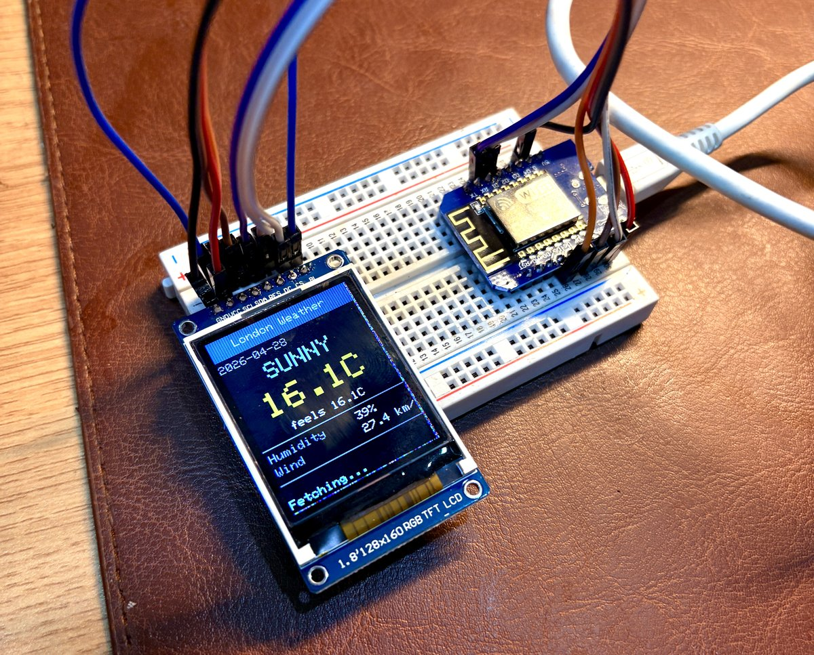

# ESP8266 Weather Monitor via Zyte API

> **Web scraping on an ESP8266/ESP32? Yes, it's possible — with [Zyte API](https://docs.zyte.com/zyte-api/get-started.html).**

This project fetches live weather data from [timeanddate.com](https://www.timeanddate.com/weather/) on a **Wemos D1 Mini (ESP8266)** using the Zyte as a scraping API, then displays it either on a 128×160 ST7735 TFT screen or the serial monitor — all within the ESP8266's ~22 KB of free RAM.



```
-----------------------------
  London Weather | 2026-04-29
-----------------------------
  Condition : Sunny
  Temp      : 17.8 C (feels 17.8 C)
  Humidity  : 37 %
  Wind      : 20.9 km/h
```

---

## Start here — minimal example

**New to the project?** Flash [`src/scraper_example/`](src/scraper_example/main.cpp) first. It scrapes [books.toscrape.com](https://books.toscrape.com) (a public scraping practice site), fits in ~160 lines, and has step-by-step comments that explain exactly how the Zyte API call and stream-decode work. No display hardware needed.

```
--- books.toscrape.com ---
  Title        : A Light in the Attic
  Price        : £51.77
  Rating       : Three stars
  Availability : In stock
```

Once you understand the example, the weather monitor variants extend the same pattern with real-world parsing and optional display output.

---

## Why Zyte API?

timeanddate.com blocks requests from data-centre IP ranges and non-browser `User-Agent` strings with a `403 Forbidden`. The ESP8266 hits both conditions simultaneously.

[Zyte API](https://docs.zyte.com/zyte-api/get-started.html) handles that and gives you back structures response. The response body is returned as a base64-encoded string inside a JSON envelope — which this firmware stream-decodes on the fly without ever buffering the full response in RAM (see [Architecture](#architecture)).

---

## Variants

| Variant | Source | Hardware needed | Build env | Default refresh |
|---|---|---|---|---|
| **Minimal example** | `src/scraper_example/` | D1 Mini only | `d1_mini_example` | 10 s |
| **Serial Monitor** | `src/serial_monitor/` | D1 Mini only | `d1_mini_serial` | 3 s |
| **TFT Display** | `src/tft_display/` | D1 Mini + ST7735 | `d1_mini_tft` | 10 min |

All three use identical networking and stream-decode logic. Start with the example, then move to whichever weather variant suits your hardware.

---

## Hardware

### Both variants
- [Wemos D1 Mini](https://www.wemos.cc/en/latest/d1/d1_mini.html) (ESP8266, 4 MB flash)
- USB cable for programming

### TFT variant only
- 1.8" ST7735 SPI TFT display, 128×160 px (widely available, ~$3)

---

## Wiring (TFT variant)

| Display pin | D1 Mini pin | GPIO | Notes |
|---|---|---|---|
| GND | GND | — | |
| VCC | 3.3V | — | Do **not** use 5V |
| SCL | D5 | GPIO14 | Hardware SPI clock |
| SDA | D7 | GPIO13 | Hardware SPI MOSI |
| RES | D1 | GPIO5 | Reset |
| DC | D2 | GPIO4 | Data/Command select |
| CS | D8 | GPIO15 | Chip select |
| BL | 3.3V | — | Backlight always on |

> If colours look wrong after flashing, try changing `tft.initR(INITR_BLACKTAB)` to `INITR_REDTAB` or `INITR_GREENTAB` in `setup()` — the tab colour varies by display seller.

---

## Prerequisites

1. **Python 3.6+** — PlatformIO runs on Python. Verify with `python3 --version`.
2. **[PlatformIO CLI](https://platformio.org/install/cli)** — install via pip or the VS Code extension (see below).
3. **Zyte API key** — [sign up at zyte.com](https://app.zyte.com/o/zyte-api/trial) (free trial available). Your key is a 32-character hex string, e.g. `a1b2c3d4e5f6a1b2c3d4e5f6a1b2c3d4`.
4. A 2.4 GHz Wi-Fi network (ESP8266 does not support 5 GHz).

---

## Setup

### 1. Install PlatformIO

**Option A — VS Code extension (recommended for beginners)**

Install the [PlatformIO IDE extension](https://marketplace.visualstudio.com/items?itemName=platformio.platformio-ide) from the VS Code marketplace. It installs the CLI automatically.

**Option B — CLI only**

```bash
pip install platformio

# Verify
pio --version
```

> On macOS you may need `pip3` instead of `pip`. If `pio` is not found after install, add `~/.local/bin` to your `PATH`.

---

### 2. Install the ESP8266 platform

This step is required on any fresh PlatformIO install. Without it you will see:
```
Error: Unknown platform 'espressif8266'
```

```bash
pio platform install espressif8266
```

This downloads the toolchain (~200 MB) and the ESP8266 Arduino core. Only needed once per machine.

---

### 3. Install USB drivers

The Wemos D1 Mini uses a **CH340** USB-to-serial chip.

| OS | Action |
|---|---|
| macOS 13+ | No driver needed — CH340 is supported natively |
| macOS 12 and earlier | Install [CH340 driver](https://github.com/adrianmihalko/ch340g-ch34g-ch34x-mac-os-x-driver) |
| Windows | Install [CH340 driver](https://www.wch-ic.com/downloads/CH341SER_EXE.html), then check Device Manager → Ports for the COM port number |
| Linux | Usually works out of the box (`/dev/ttyUSB0`). If not: `sudo apt install brltty` may be conflicting — remove it |

Plug in the D1 Mini and confirm the port appears before continuing.

---

### 4. Clone the repository and install dependencies

```bash
git clone https://github.com/zytelabs/webscraping-on-esp8266.git
cd webscraping-on-esp8266

# Install all project libraries (Adafruit GFX, ST7735, etc.)
pio pkg install
```

`pio pkg install` reads `platformio.ini` and downloads every `lib_deps` entry into `.pio/libdeps/`. Run this once after cloning. If you skip it, the first `pio run` will install them automatically — but having them pre-installed avoids surprises.

---

### 5. Set your credentials

Open the source file for the variant you want to use and fill in the three required values at the top of the `USER CONFIGURATION` block:

**Minimal example** → [src/scraper_example/main.cpp](src/scraper_example/main.cpp)  
**Serial variant** → [src/serial_monitor/main.cpp](src/serial_monitor/main.cpp)  
**TFT variant** → [src/tft_display/main.cpp](src/tft_display/main.cpp)

```cpp
#define WIFI_SSID    "YOUR_WIFI_SSID"       // ← your 2.4 GHz network name
#define WIFI_PASS    "YOUR_WIFI_PASSWORD"   // ← your Wi-Fi password
#define ZYTE_API_KEY "YOUR_ZYTE_API_KEY"    // ← your Zyte API key
```

---

### 6. Set the serial port

Find the port your D1 Mini is connected to:

```bash
# macOS
ls /dev/tty.*            # look for something like /dev/tty.usbserial-XXXX

# Linux
ls /dev/ttyUSB*          # usually /dev/ttyUSB0

# Windows — check Device Manager → Ports (COM & LPT) → looks like COM3
```

Open [platformio.ini](platformio.ini) and update `upload_port` and `monitor_port` in **all three environments**:

```ini
upload_port = /dev/tty.usbserial-XXXX   ; ← replace with your port
monitor_port = /dev/tty.usbserial-XXXX  ; ← same port
```

---

### 7. Build and flash

```bash
# Recommended first step — minimal scraper, no display hardware needed
pio run -e d1_mini_example --target upload

# Serial Monitor weather variant
pio run -e d1_mini_serial --target upload

# TFT Display weather variant
pio run -e d1_mini_tft --target upload
```

> **Port busy?** If flashing fails with a port error, the serial monitor from a previous session may still be holding the port. Kill it first:
> ```bash
> # macOS / Linux
> lsof /dev/tty.usbserial-XXXX 2>/dev/null | awk 'NR>1{print $2}' | xargs kill 2>/dev/null
> ```
> On Windows, simply close any open serial monitor window.

---

### 8. Monitor serial output

```bash
pio device monitor
```

Press `Ctrl+C` to exit. For the example and serial variants, the device connects to Wi-Fi and immediately starts printing scraped data. The TFT variant also syncs NTP and renders the graphical UI.

---

## Configuration Reference

All tuneable constants live at the top of each `main.cpp` in the `USER CONFIGURATION` block:

| Constant | Default | Description |
|---|---|---|
| `WIFI_SSID` | `"YOUR_WIFI_SSID"` | 2.4 GHz Wi-Fi network name |
| `WIFI_PASS` | `"YOUR_WIFI_PASSWORD"` | Wi-Fi password |
| `ZYTE_API_KEY` | `"YOUR_ZYTE_API_KEY"` | Zyte API key |
| `CITY_NAME` | `"London"` | City label for display / serial output |
| `TIMEANDDATE_URL` | `https://…/weather/uk/london` | timeanddate.com weather page URL |
| `CAPTURE_LEN` | `800` | Bytes captured after the HTML anchor (rarely needs changing) |
| `REFRESH_MS` | `600000` (TFT) / `3000` (serial) | Fetch interval in milliseconds |
| `TFT_CS` | `15` | TFT Chip Select GPIO (TFT variant only) |
| `TFT_DC` | `4` | TFT Data/Command GPIO (TFT variant only) |
| `TFT_RST` | `5` | TFT Reset GPIO (TFT variant only) |

---

## Changing the City

1. Find the timeanddate.com weather URL for your city, e.g.:
   - London → `https://www.timeanddate.com/weather/uk/london`
   - New York → `https://www.timeanddate.com/weather/usa/new-york`
   - Tokyo → `https://www.timeanddate.com/weather/japan/tokyo`

2. Update both constants in `main.cpp`:

```cpp
#define CITY_NAME       "Tokyo"
#define TIMEANDDATE_URL "https://www.timeanddate.com/weather/japan/tokyo"
```

The HTML parsing anchors (`class=h2>`, `Feels Like:`, etc.) are consistent across all city pages, so no other changes are needed.

---

## Build / Flash / Debug

```bash
# Build without flashing
pio run -e d1_mini_serial
pio run -e d1_mini_tft

# Flash (if the serial monitor is open and holding the port, kill it first)
lsof /dev/tty.usbserial-XXXX 2>/dev/null | awk 'NR>1{print $2}' | xargs kill 2>/dev/null
pio run -e d1_mini_serial --target upload

# Open serial monitor (Ctrl+C to exit)
pio device monitor

# Clean build artifacts
pio run --target clean
```

**Finding your serial port:**
```bash
# macOS
ls /dev/tty.*

# Linux
ls /dev/ttyUSB* /dev/ttyACM*

# Windows — check Device Manager → Ports (COM & LPT)
```

---

## Architecture

### The memory problem

The ESP8266 has only **~22 KB of free heap** at runtime. The Zyte API response is **~62 KB** — the base64 encoding of a 46 KB HTML page wrapped in a JSON envelope. That is nearly 3× available memory.

The naive approach fails immediately:

```cpp
String body = http.getString();  // tries to allocate ~62 KB → crash
```

### The solution: stream, decode, drop

Instead of buffering the response, the firmware treats the TCP socket as a pipe and processes it in a single forward pass — never holding more than 801 bytes in memory at once.

```
Zyte JSON response (~62 KB over TCP)
│
├── {"httpResponseBody":"           ← scanned byte-by-byte, never stored
│
├── PGh0bWw+...base64...            ← decoded one character at a time
│   │
│   ├── <html><head>...~7 KB...     ← decoded bytes are checked against
│   │                                  the anchor pattern, then thrown away
│   ├── <div class=h2>              ← anchor matched — buffer opens
│   │
│   ├── 64°F Sunny Feels 61°F...    ← only these 800 bytes are kept
│   │
│   └── ...remaining ~39 KB...      ← http.end() closes the socket here;
│                                      data is never read from TCP at all
└── "}
```

**Peak heap usage: ~810 bytes** (the 800-byte capture buffer + a few bytes of decoder state).

### How the base64 decoder works

Base64 encodes every 3 bytes of binary data as 4 ASCII characters. The decoder accumulates 6 bits per input character using a single integer accumulator (`B64State`) and emits one decoded byte every time it has collected 8 bits:

```cpp
struct B64State { int val = 0, bits = -8; };

static int b64Char(char c, B64State& st) {
    st.val = (st.val << 6) + index_of(c);   // shift in 6 bits
    st.bits += 6;
    if (st.bits >= 0) {                      // have a full byte?
        int byte = (st.val >> st.bits) & 0xFF;
        st.bits -= 8;
        return byte;                         // emit it
    }
    return -1;                               // not yet
}
```

This runs character by character directly off the TCP stream — no intermediate buffer, no heap allocation.

### How the anchor search works

While decoding, every emitted byte is simultaneously matched against the anchor string `class=h2>` using a simple KMP-style single-pass matcher:

```cpp
anchorMatch = (c == ANCHOR[anchorMatch]) ? anchorMatch + 1
            : (c == ANCHOR[0])           ? 1 : 0;
```

If the character matches the next expected character in the anchor, the match counter advances. If not, it resets to zero (or 1 if the character happens to match the anchor's first character). No backtracking, no memory — just one integer. The moment `anchorMatch == ALEN` the anchor is found and capture begins.

### Why this is robust

A fixed byte offset (`SKIP_BYTES = 7400`) would also work — but only until the page slightly changes size between requests. The anchor search finds the weather widget regardless of how much HTML precedes it, making the firmware resilient to minor page-size variations without any code changes.

For the full design notes and error history see [ARCHITECTURE.md](ARCHITECTURE.md).

---

## Troubleshooting

| Symptom | Likely cause | Fix |
|---|---|---|
| `[Zyte] HTTP 401` | Invalid API key | Check `ZYTE_API_KEY` |
| `[Zyte] HTTP 422` | Malformed request body | Verify `TIMEANDDATE_URL` is a valid timeanddate.com URL |
| `WiFi failed!` | Wrong SSID/password or 5 GHz band | Double-check credentials; ensure network is 2.4 GHz |
| `NTP failed` | NTP timeout (hotspot / firewall) | Increase timeout in `syncNTP()` or try a different network |
| `[Parse] weather fields not found` | timeanddate.com changed their HTML | Increase `CAPTURE_LEN` or update the `ANCHOR` string in `fetchWeather()` |
| Port busy when flashing | `pio device monitor` holds the tty | `lsof /dev/tty.usbserial-XXX \| awk 'NR>1{print $2}' \| xargs kill` |
| Wrong colours on TFT | Tab colour variant | Change `INITR_BLACKTAB` → `INITR_REDTAB` or `INITR_GREENTAB` in `setup()` |

---

## Dependencies & Citations

| Library / Service | Purpose | Link |
|---|---|---|
| **Zyte API** | Residential proxy + browser-header spoofing for scraping | [docs.zyte.com](https://docs.zyte.com/zyte-api/get-started.html) |
| **timeanddate.com** | Source of weather data | [timeanddate.com/weather](https://www.timeanddate.com/weather/) |
| **Adafruit GFX Library** | Graphics primitives for TFT variant | [github.com/adafruit/Adafruit-GFX-Library](https://github.com/adafruit/Adafruit-GFX-Library) |
| **Adafruit ST7735 Library** | ST7735/ST7789 TFT driver | [github.com/adafruit/Adafruit-ST7735-Library](https://github.com/adafruit/Adafruit-ST7735-Library) |
| **ESP8266 Arduino Core** | `ESP8266WiFi`, `ESP8266HTTPClient`, `WiFiClientSecure`, `base64` | [github.com/esp8266/Arduino](https://github.com/esp8266/Arduino) |
| **PlatformIO** | Build system and library manager | [platformio.org](https://platformio.org/) |

---

## License

[MIT](LICENSE) — free to use, modify, and distribute.
